#同芙三期设计文档：

## 接口文档补充
# 该文档十分重要！！！请每个字都读一读！
#!!! header中存放 type:分类，longitude:经度, latitude:纬度 有时候可能回放header，可能会放body，但是只认header的参数就好了
### 0727

#### body 新增type

### 0723
          
#### /tf/category/pay/baseInfo 确认订单基本信息：
传参：
修改点：新增

```
泛型id: did, 支持商店id,专家id,商品id
预约类型：appoint_type:
专家：APPOINT_TYPE_EXPERT， 
商店：APPOINT_TYPE_SHOP, 
商品：APPOINT_TYPE_PRODUCT
```
返回值不变
-----

#### /tf/category/service/schedule 获取可预约日期
传参：
修改点：新增

```
泛型id: did, 支持商店id,专家id,商品id
预约类型：appoint_type:
专家：APPOINT_TYPE_EXPERT， 
商店：APPOINT_TYPE_SHOP, 
商品：APPOINT_TYPE_PRODUCT
```

返回值不变
-----
#### /tf/category/shop
传参：
修改点：新增

```
泛型id: did, 支持商店id,专家id,商品id
预约类型：appoint_type:
商店：APPOINT_TYPE_SHOP, 
商品：APPOINT_TYPE_PRODUCT
```

返回值不变
----

####

#### /tf/category/service/list 预约中心

##### 传参 :

修改点：原来的type,改为appoint_type

```
appoint_type:
(全部默认)APPOINT_ALL, 
(预约到店)SERVICE_OFFLINE, 
(已经完成)SERVICE_FINSH, 
(取消)SERVICE_CANCEL

```
返回值：
修改点：原来的shop，改为detail,新增type字段。

```
type支持：

专家：APPOINT_TYPE_EXPERT， 
商店：APPOINT_TYPE_SHOP, 
商品：APPOINT_TYPE_PRODUCT
example:
[
{
	"type":"APPOINT_TYPE_EXPERT",
	"detail":{
		"id":"123123", //泛型id: 支持商店id,专家id,商品id
		"name": "同福健康美容会有点"
	},
	"appoint":{
		"commit_date": "2021-01-21 8:00",
		"book_date":"2021-01-21 8:00",
		"finish_date": "2021-01-21 8:00",
		"status":"SERVICE_FINSH"
	}
}
]
```


### 0716 
新增首页跳转 type_more

### 0708

首页样式 新增 category-travel-1

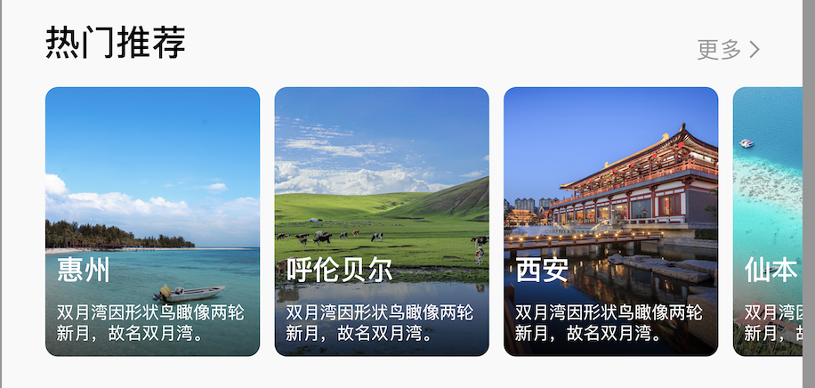

### 可配置页面说明

*  category/more  // 显示更多，且跳到列表


*  category/subsection  // 品质机构tag更新列表

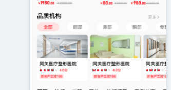

```
点击tag更新
```

*  category/searchType

```
searchshop/searchproduct 可以支持footer的选项！！！
头部选项可支持：如全部项目，深层清洁，保湿补水
"category-style": 
"image", // 图片 + 文字
"text", //文字
```
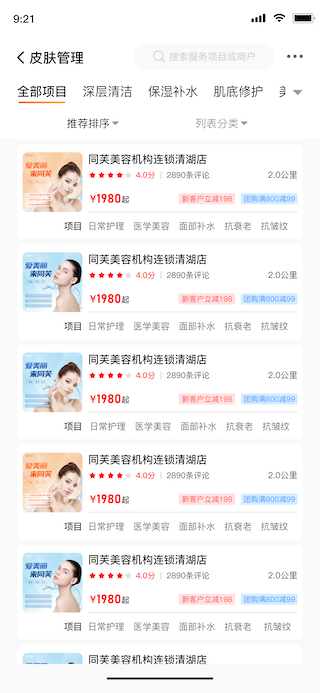

* /category/shopDetail

```
支持4种样式
type：
type_video
type_html
type_expert
type_image

按需要在接口上面扩展数据

数据结构:
{
    "title": "视频介绍",
    "type": "type_video",
    "list": [
        {
            "id": "asdfaefasdfasdf",
            "url": "http://www.baidu.com",
            "imagePath": "http://112.74.166.59:5000/public/download/1616941007514",
            "visNum": "20",
            "timeDis": "4:00"
        }
    ]
},
    {
        "title": "详细介绍",
        "type": "type_html",
        "list": [
            "<html>asdf</html>"
        ]
    },
    {
        "title": "医生介绍",
        "type": "type_expert",
        "list": [
            {
                "id": "10",
                "name": "王蓉",
                "chatid": "asdfdfe",
                "title": "主任医师",
                "desp": "50年工作经验",
                "colNum": 12345,
                "score": 4.0,
                "content": "服务态度特别好，产品质量可以保障。做完皮肤效果也不错，值得推荐。服务态度特别好，产品质量可以保障",
                "skilltags": [
                    "以色列",
                    "阿廖秋",
                    "土耳其"
                ],
                "serviceNum": 2600,
                "consultNum": 2600,
                "proNum": 2600,
                "cert": "同芙旅游养老机构旅游顾问",
                "imageList": [
                    "http://112.74.166.59:5000/public/download/16177227781png",
                    "http://112.74.166.59:5000/public/download/16177227781png"
                ]
            }
        ]
    },
    {
        "title": "图片介绍",
        "type": "type_image",
        "list": [
            "http://112.74.166.59:5000/public/download/1616941007514",
            "http://112.74.166.59:5000/public/download/1616941007514",
            "http://112.74.166.59:5000/public/download/1616941007514"
        ]
    }
```


-----

* category/product

中间商品选项可以按需添加

```
detaillist可以无限增加，content主要存放html
...
shop:{
detaillist:[
{
     "title": "课程详情",
     "content": "<html>sdfasdfwef</html>"
  },
]
}
...

```


### 接口说明


#### 当subid不传，或为空，则默认传第一个tag的数据，前端将会默认选中第一个tag!!!
* category/home-footer (首页footer更新接口)


```
id    - footer{tags(这个id),data{tags(不是这个)}} footer的大分类section
subid - footer{tags(不是这个),data{tags(是这个)}} footer的小分类例如：理我最近，口碑最好，等

```

* category/productRecommend 推荐通用接口，支持推荐商店！推荐商品

```
productid - 商品id
shopid		- 商店id
```

---
* category/searchshop
* category/searchpro

```
categoryid -- 首页传进来
sortid		 -- 排序id
keyword	 -- (全部，东南亚，等关键字)
tagidlist  -- 筛选 筛选里面的tagSort里面的id集合,兼容一个类别里面选择多个的情况[{'1':['1','2']},{'2':['1','2']}]
```

---

* category/service/list 预约列表

```
type:  (全部默认)APPOINT_ALL, 
		(预约到店)SERVICE_OFFLINE, 
		(已经)SERVICE_FINSH, 
		(取消)SERVICE_CANCEL"

```

* category/pay/totalAmountInfo 计算总价格

```
goodsList:[{ 商店id:
[{'id':商品id, 'num':'商品数量'，'attrubuteId':'可以为空'}]}]"		
#todo 前端
travelInfo:"[{ 商店id:[{'id':商品id, 
							'num_adult':'成人数量', 
							'num_child':'小孩数量'，
							'attrubuteId':'serviceid',
							'day':7,
							'month':6,
							'year':2021}]}]"
```

* category/service/schedule 获取可预约日期(专家/顾问/机构/医院)

```
shopid    -- 机构/医院 id
expertid	-- 专家/顾问 id
schedule  -- 获取当前日期，如： 7-11
```

* category/shop/travelDest 目的地接口

```
areaid -- areaid 定位可选id
city   -- 城市名字 比如中山，珠海
```

* category/shop/travelUpdate 目的地推荐tags切换后的数据

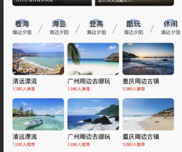

---

* category/shop/appoint   商店预约
* category/expert/appoint 专家预约 

```
action: edit,confirm,delete,cancel
appointid : 有就传，当他是confirm的时候，需要传
day: 预约具体日期，如 5-11
time: am/pm 可以为空
timeQuantum: 具体时间：9:00,9:30
```
---

* category/shopcar/add 添加商品到购物车

```
product_list:"[{ 商店id:[{'id':商品id, 'num':'商品数量'，'attrubuteId':'sdf'}]}]"
#todo 前端
travelInfo:"[{ 商店id:[{'id':商品id, 
							'num_adult':'成人数量', 
							'num_child':'小孩数量'，
							'attrubuteId':'serviceid',
							'day':7,
							'month':6,
							'year':2021}]}]"
```

* category/shopcar/delete 移除购物车的商品

```
当数量=-1,删掉该商品下的所有数量
product_list:"[{ 商店id:[{'id':商品id, 'num':'商品数量'，'attrubuteId':'sdf'}]}]"
```

* category/pay/createorder 创建订单 结算订单,当且仅当travel的时候，输入travelInfo

```
goodsList:"[{ 商店id:[{'id':商品id, 'num':'商品数量'，'attrubuteId':'sdf'}]}]"
#todo 前端
travelInfo:"[{ 商店id:[{'id':商品id, 
							'num_adult':'成人数量', 
							'num_child':'小孩数量'，
							'attrubuteId':'serviceid',
							'day':7,
							'month':6,
							'year':2021}]}]"
```

* category/pay/orderAction 订单操作

```
actionType:  del,cancel
```

* category/message/taglist 进入im的时候的快速点击tag


## 首页说明

## isMore 字段，是展示更多列表

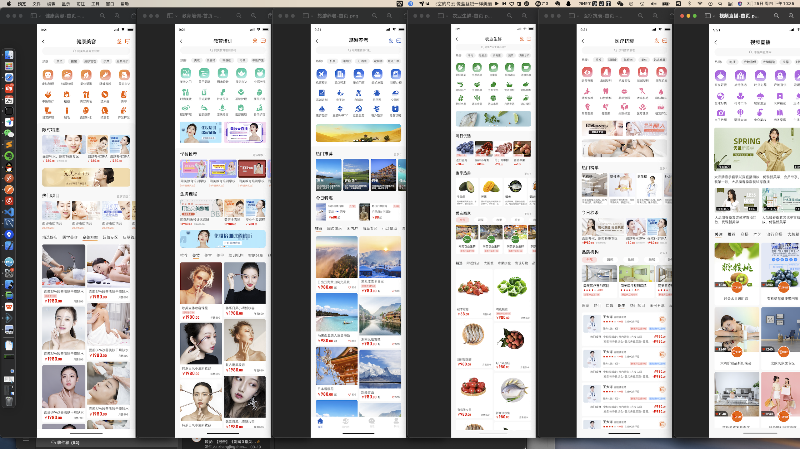

### 总体来说分为三部分:
1. header (search,tag,)
2. body (category)
3. footer (recommend)

### header:
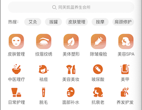

### body:


### footer:
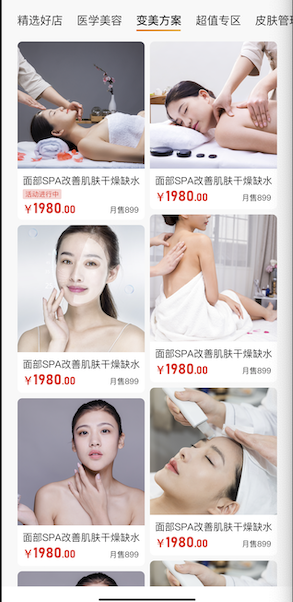

### 主要是以body作为区分，样式包括：


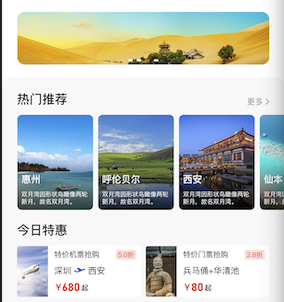
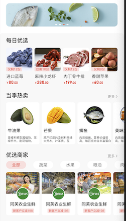


## nav_type(首页共用，body,footer):
```
* CATEGORY_COS_PRO_DETAIL (健康美容-商品详情)
* CATEGORY_COS_SHOP_DETAIL (健康美容-商店详情)
* CATEGORY_COS_EXPERT_DETAIL (健康美容-专家详情)

* CATEGORY_EDU_PRO_DETAIL (教育培训-服务详情)
* CATEGORY_EDU_SHOP_DETAIL (教育培训-机构详情)
* CATEGORY_EDU_EXPERT_DETAIL (教育培训-专家详情)

* CATEGORY_TRAVEL_PRO_DETAIL (旅游养老-服务)
* CATEGORY_TRAVEL_SHOP_DETAIL (旅游养老-机构)
* CATEGORY_TRAVEL_EXPERT_DETAIL (旅游养老-专家详情)
* CATEGORY_TRAVEL_DEST_DETAIL (旅游养老-目的地详情)

* CATEGORY_COMMUNITY_PRO_DETAIL (农业生鲜)
* CATEGORY_COMMUNITY_SHOP_DETAIL (农业生鲜)

* CATEGORY_MEDICAL_PRO_DETAIL  (医疗抗衰-服务)
* CATEGORY_MEDICAL_SHOP_DETAIL  (医疗抗衰-机构)
* CATEGORY_MEDICAL_EXPERT_DETAIL  (医疗抗衰-专家详情)


* type_eShop (网上商城)
* type_living (跳转到直播)
* type_video (跳转到视频)
* type_url (跳转到url)
* type_more (跳转更多列表)
```
### body细分样式：
### list:[productDetail]


#### category-1 (一长两短)


#### category-2 (轮训)


#### category-3 (无限右滑)


#### category-4 (两短)


#### category-5 (两短 2)
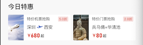


#### category-6 (四短-带标题)
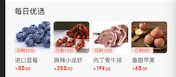


#### category-7 (一长带标题)


#### category-8 (两短-带标题)


#### category-9 (无限右滑+分类)


#### category-10 热门推荐（无限右滑）


#### category-tabs-1 (品质机构无限右滑)


#### category-travel-1 旅游热门推荐（无限右滑）


---- 

## 只有在目的地才能使用

####  category-11(目的地 特色体验-无限右滑)
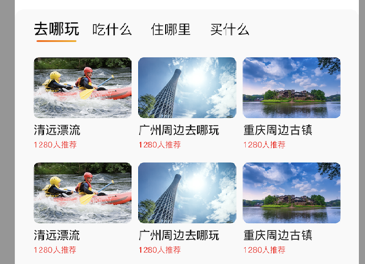

#### category-12 (目的地 特色体验-无限右滑)
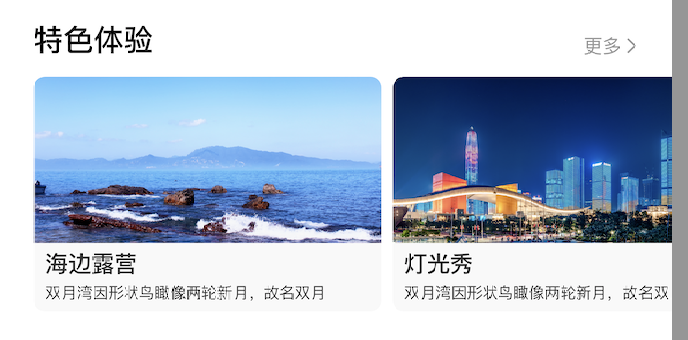


----


### footer:
#### footer-1 (带tag-cell-tag)
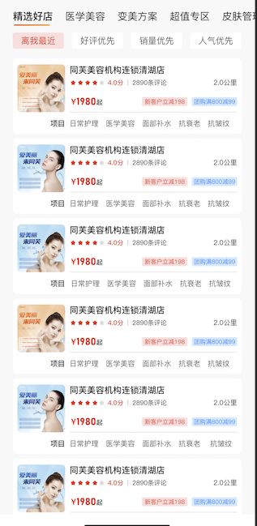


#### footer-2 (瀑布流)


#### footer-3 ()


#### footer-4 (带头像)


#### footer-5 (带头像)


```
"footer-1": {
    "title": "特价机票抢购",
    "discout": "5.0",
    "id": "asdfaefasdfasdf",
    "name": "0基础培训课程",
    "score": 4.0,
    "selNum": 100,
    "commentNum": 2000,
    "marketPrice": 2000,
    "imageList": [
        "http://112.74.166.59:5000/public/download/1616941007514",
        "http://112.74.166.59:5000/public/download/1616941007514",
        "http://112.74.166.59:5000/public/download/1616941007514",
        "http://112.74.166.59:5000/public/download/1616941007514"
    ],
    "commonNum": "2800评论",
    "dis": "2.0公里",
    "price": "1980起",
    "discountlist": [
        "新用户减100",
        "满100减50"
    ],
    "tagName": "项目",
    "taglist": [
        "日常护理",
        "医学美容",
        "面部补水"
    ],
    "nav_type": "CATEGORY_MEDICAL_SHOP_DETAIL"
},

```

```
"footer-5": {
   {
         "nav_type": "CATEGORY_MEDICAL_SHOP_DETAIL",
         "title": "特价机票抢购",
         "discout": "5.0",
         "imageList": [
            "http://112.74.166.59:5000/public/download/1616941007514",
            "http://112.74.166.59:5000/public/download/1616941007514",
            "http://112.74.166.59:5000/public/download/1616941007514",
            "http://112.74.166.59:5000/public/download/1616941007514"
         ],
         "id": "asdf",
         "imagePath": "http://112.74.166.59:5000/public/download/1616941007514",
         "name": "同芙美容连锁",
         "commonNum": "2800评论",
         "score": 4.0,
         "selNum": 100,
         "commentNum": 2000,
         "marketPrice": 2000,
         "dis": "2.0公里",
         "price": "1980起",
         "discountlist": [
            "新用户减100",
            "满100减50"
         ],
        "sub": [
            {
                "id": "123",
                "name": "sdf",
                "price": 100
            }
        ],
         "tagName": "项目",
         "taglist": [
            "日常护理",
            "医学美容",
            "面部补水"
         ]
      }},

```


```
"footer-3": {
    "id": "asdf",
    "imagePath": "http://www.baidu.com",
    "name": "同芙美容连锁",
    "rightTag": "月售899",
    "width": "0.5",
    "height": 200,
    "leftTag": "1280",
    "nav_type": "CATEGORY_MEDICAL_SHOP_DETAIL"
},
```

```
"footer-2": {
    "title": "旅游旅游",
    "discout": "5.0",
    "imageList": [
        "http://112.74.166.59:5000/public/download/1616941007514",
        "http://112.74.166.59:5000/public/download/1616941007514",
        "http://112.74.166.59:5000/public/download/1616941007514",
        "http://112.74.166.59:5000/public/download/1616941007514"
    ],
    "id": "asdf",
    "imagePath": "http://112.74.166.59:5000/public/download/1616941007514",
    "name": "旅游旅游",
    "commonNum": "2800评论",
    "score": 4.0,
    "selNum": 100,
    "commentNum": 2000,
    "marketPrice": 2000,
    "dis": "2.0公里",
    "price": "1980起",
    "discountlist": [
        "新用户减100",
        "满100减50"
    ],
    "tagName": "项目",
    "taglist": [
        "旅游旅游"
    ],
    "nav_type": "CATEGORY_TRAVEL_SHOP_DETAIL"
},
```

```
"footer-4": {
    "nav_type": "CATEGORY_MEDICAL_SHOP_DETAIL",
    "expert": {
        "id": "7",
        "name": "张萌",
        "title": "主任医师",
        "desp": "50年工作经验",
        "colNum": 2600,
        "skilltags": [
            "脸部SPA",
            "颈部按摩"
        ],
        "serviceNum": 2600,
        "consultNum": 2600,
        "proNum": 2600,
        "cert": "同芙健康美容连锁会员店",
        "imagePath": "http://112.74.166.59:5000/public/download/16177227781png"
    },
    "title": "教育教育",
    "discout": "5.0",
    "imageList": [
        "http://112.74.166.59:5000/public/download/1616941007514",
        "http://112.74.166.59:5000/public/download/1616941007514",
        "http://112.74.166.59:5000/public/download/1616941007514",
        "http://112.74.166.59:5000/public/download/1616941007514"
    ],
    "id": "asdf",
    "imagePath": "http://112.74.166.59:5000/public/download/1616941007514",
    "name": "教育教育",
    "commonNum": "2800评论",
    "collNum": "1400",
    "score": 4.0,
    "selNum": 100,
    "commentNum": 2000,
    "marketPrice": 2000,
    "dis": "2.0公里",
    "price": "1980起",
    "discountlist": [
        "新用户减100",
        "满100减50"
    ],
    "tagName": "项目",
    "taglist": [
        "教育教育",
        "医学美容",
        "面部补水"
    ]
}
```
# Search Cell Style
## 与home-footer保持一致 （footer-1,footer-2...）


### 特别注意：
1.搜索商店时候：
shop 
category/searchshop

```
{
	"style":"cell-1",
    "list":[
        {
            "id": "asdfasdf",
            ""name"": "同芙健康连锁会员店",
            "address": "坂田大道富村弄",
            "longitude": 12.012,
            "latitude": 12.012,
            "phone": "1212312123",
            "score": "4.0",
            "colNum": "2000",
            "imageList": [
                "http://112.74.166.59:5000/public/download/1616941007514",
                "http://112.74.166.59:5000/public/download/1616941007514",
                "http://112.74.166.59:5000/public/download/1616941007514",
                "http://112.74.166.59:5000/public/download/1616941007514"
            ]
        },
        {
            "id": "asdfasdf",
            ""name"": "同芙健康连锁会员店2",
            "address": "坂田大道富村弄",
            "longitude": 12.012,
            "latitude": 12.012,
            "phone": "1212312123",
            "imageList": [
                "http://112.74.166.59:5000/public/download/1616941007514",
                "http://112.74.166.59:5000/public/download/1616941007514",
                "http://112.74.166.59:5000/public/download/1616941007514",
                "http://112.74.166.59:5000/public/download/1616941007514"
            ]
        }
    ]
}

```


2.搜索商品

```

{
	"style":"cell-1",
    "list":[
        {
            "v"id"eoList": [
                {
                    "id": "asdfaefasdfasdf",
                    "url": "http://www.ba"id"u.com",
                    "visNum": "20",
                    "timeDis": "4:00"
                },
                {
                    "id": "asdfaefasdfasdf",
                    "url": "http://www.ba"id"u.com",
                    "visNum": "20",
                    "timeDis": "4:00"
                }
            ],
            "title": "特价机票抢购",
            "discout": "5.0",
            "id": "asdfaefasdfasdf",
            ""name"": "0基础培训课程",
            "score": 4.0,
            "selNum": 100,
            "price": 1980,
            "commentNum": 2000,
            "marketPrice": 2000,
            "desp": [
                "课程形式：小班授课",
                "适用阶段:宁基础入门"
            ],
            "discountlist": [
                "新用户减100",
                "满100减50"
            ],
            "imageList": [
                "http://112.74.166.59:5000/public/download/1616941007514",
                "http://112.74.166.59:5000/public/download/1616941007514",
                "http://112.74.166.59:5000/public/download/1616941007514",
                "http://112.74.166.59:5000/public/download/1616941007514"
            ]
        }
    ]
}

```


# API 描述：

## 首页：


### 红色部分： /tf/category/home
### 红色部分-cell 更多： /tf/category/home-category 
### 绿色部分：/tf/category/home-footer
---
## 商店详情

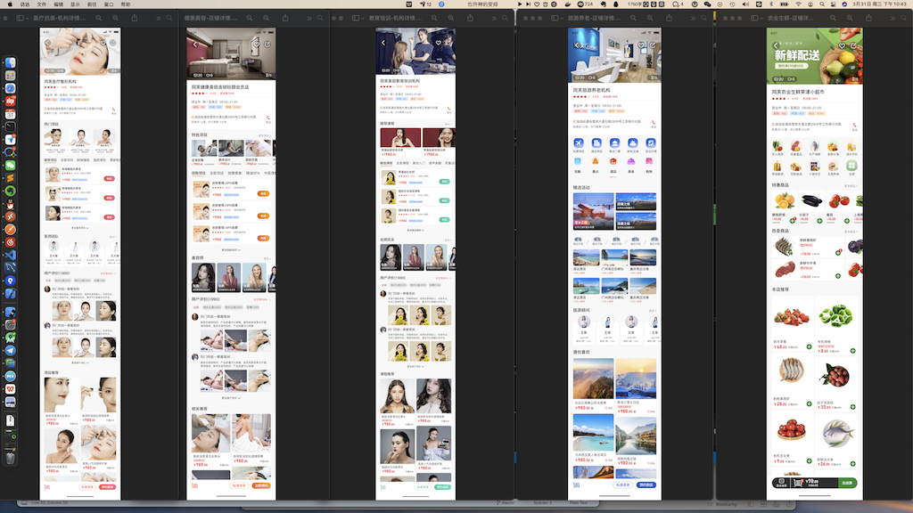

### tf/category/shop

---

## 机构详情


### /tf/category/shopDetail
---

## 购物车分类
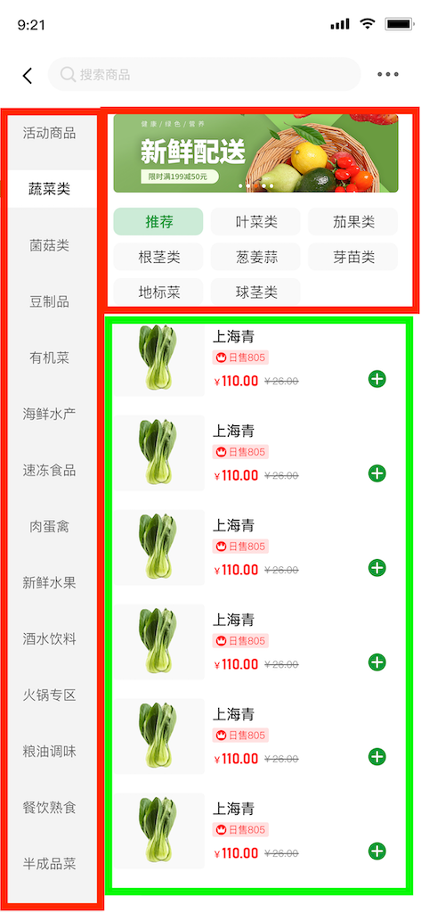
### 红色部分：/tf/category/shopMenu
### 绿色部分：/tf/category/shopAll
---

## 专家详情：

### /tf/category/expert
---

### /tf/category/productDetail
---
## 各种推荐专用接口(用于各种详情下面的推荐)
### /tf/category/productRecommend

## 评论专用接口(用于更多评论)
### /tf/category/productCommend

## 筛选
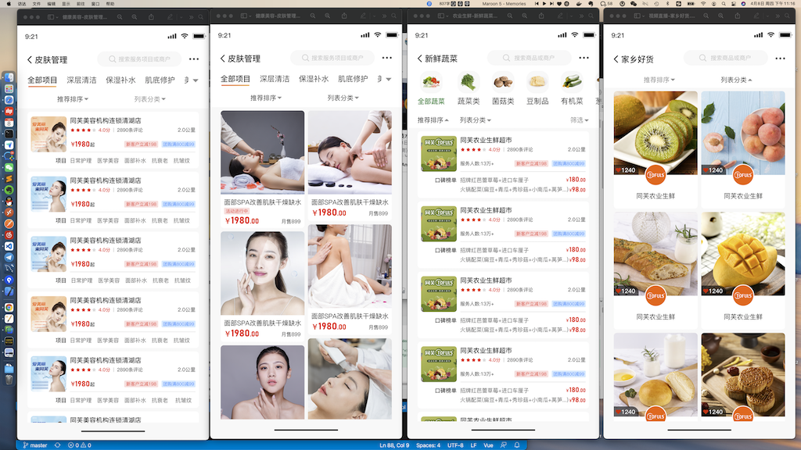

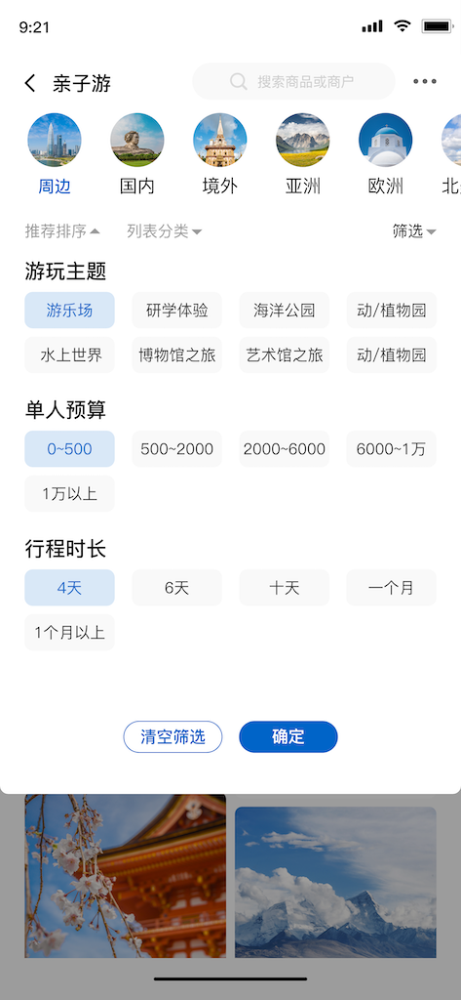

### /tf/category/searchType 包括排序和筛选(可多选)，头部分类（图片可以无）

### 搜索商店 /tf/category/searchshop
### 搜索商品 /tf/category/searchshop

## 服务
###预约服务详情 /category/service/schedule
### schedule, list两个对应两种不同的UI, schedule的优先级会更高

```
 "schedule":[],##当 schedule = 5-1 的时候会出现
 "list":[],
 "dsp":"预期说声哈"
```

##### 读取 schedule 字段

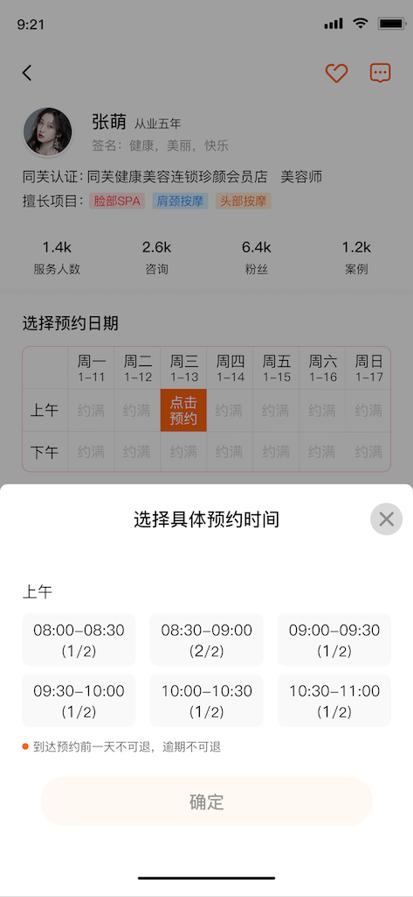

##### 读取 list 字段

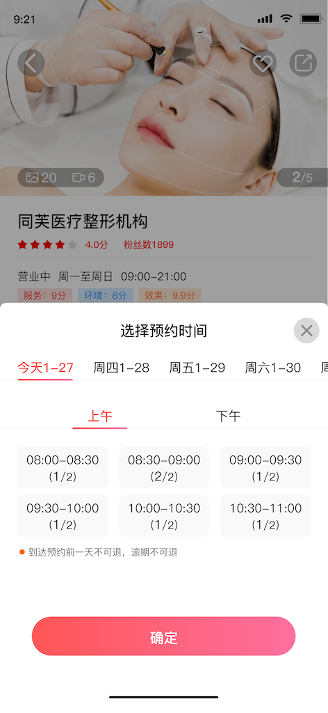

----

### 我的-预约列表 /category/service/list
```
(全部)APPOINT_ALL, 
(预约到店)SERVICE_OFFLINE, 
(完成)SERVICE_FINSH, 
(取消)SERVICE_CANCEL,
```
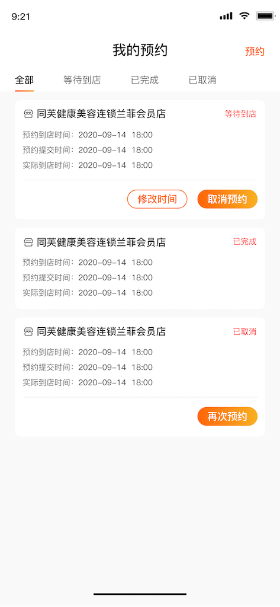

