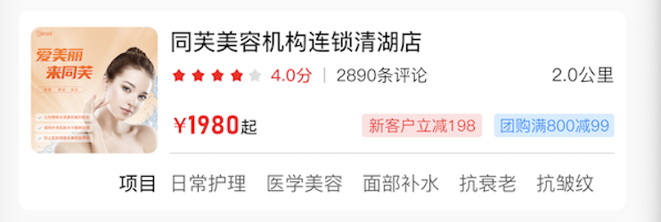
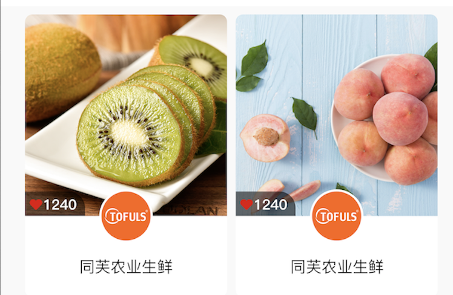

#同芙三期设计文档：


### 总体来说分为三部分:
1. header (search,tag,)
2. body (category)
3. footer (recommend)

### header:


### body:


### footer:


### 主要是以body作为区分，样式包括：


## navi_type(首页共用，body,footer):
```
* CATEGORY_COS_PRO_DETAIL (健康美容-商品详情)
* CATEGORY_COS_SHOP_DETAIL (健康美容-商店详情)
* CATEGORY_COS_EXPERT_DETAIL (健康美容-专家详情)

* CATEGORY_EDU_PRO_DETAIL (教育培训-服务详情)
* CATEGORY_EDU_SHOP_DETAIL (教育培训-机构详情)
* CATEGORY_EDU_EXPERT_DETAIL (教育培训-专家详情)

* CATEGORY_TRAVEL_PRO_DETAIL (旅游养老-服务)
* CATEGORY_TRAVEL_SHOP_DETAIL (旅游养老-机构)
* CATEGORY_TRAVEL_EXPERT_DETAIL (旅游养老-专家详情)

* CATEGORY_COMMUNITY_PRO_DETAIL (农业生鲜)
* CATEGORY_COMMUNITY_SHOP_DETAIL (农业生鲜)

* CATEGORY_MEDICAL_PRO_DETAIL  (医疗抗衰-服务)
* CATEGORY_MEDICAL_SHOP_DETAIL  (医疗抗衰-机构)
* CATEGORY_MEDICAL_EXPERT_DETAIL  (医疗抗衰-专家详情)

* CATEGORY_LIVING (视频直播)
* type_eShop (网上商城)
* type_living (跳转到直播)
* type_video (跳转到视频)
* type_url (跳转到url)
```
### body细分样式：
### list:[productDetail]


#### category-1 (一长两短)


#### category-2 (轮训)


#### category-3 (无限右滑)


#### category-4 (两短)


#### category-5 (两短 2)


#### category-6 (四短-带标题)


#### category-7 (一长带标题)


#### category-8 (两短-带标题)


#### category-9 (无限右滑+分类)


```

    "category-1": {
        "nav_type": "CATEGORY_EDU_PRO_DETAIL",
        "title": "国际形象设计名师班",
        "discout": "",
        "id": "1",
        "name": "国际形象设计名师班",
        "score": 4.0,
        "selNum": 100,
        "price": 1980,
        "commentNum": 2000,
        "marketPrice": 2000,
        "desp": [
            "课程形式：小班授课",
            "适用阶段:宁基础入门"
        ],
        "imageList": [
            "http://112.74.166.59:5000/public/download/1616941007514",
            "http://112.74.166.59:5000/public/download/1616941007514",
            "http://112.74.166.59:5000/public/download/1616941007514",
            "http://112.74.166.59:5000/public/download/1616941007514"
        ]
    },
```

```
    "category-2": {
        "nav_type": "CATEGORY_MEDICAL_PRO_DETAIL",
        "id": "asdf",
        "imageList": [
            "http://112.74.166.59:5000/public/download/1621173621200"
        ],
        "url": "http://www.baidu.com"
    },
```

```
    "category-3": {
        "id": "asdfaefasdfasdf",
        "name": "0基础培训课程",
        "score": 4.0,
        "selNum": 100,
        "price": 1980,
        "commentNum": 2000,
        "marketPrice": 2000,
        "desp": [
            "课程形式：小班授课",
            "适用阶段:宁基础入门"
        ],
        "imageList": [
            "http://112.74.166.59:5000/public/download/1616941007514",
            "http://112.74.166.59:5000/public/download/1616941007514",
            "http://112.74.166.59:5000/public/download/1616941007514",
            "http://112.74.166.59:5000/public/download/1616941007514"
        ],
        "nav_type": "CATEGORY_MEDICAL_PRO_DETAIL"
    }

```

```
    "category-4": {
        "nav_type": "type_url",
        "id": "1",
        "imagePath": "http://112.74.166.59:5000/public/download/1621170599309",
        "url": "http://www.baidu.com"
    },
```

```
    "category-5": {
        "title": "特价机票抢购",
        "discout": "5.0",
        "id": "asdfaefasdfasdf",
        "name": "0基础培训课程",
        "score": 4.0,
        "selNum": 100,
        "price": 1980,
        "commentNum": 2000,
        "marketPrice": 2000,
        "desp": [
            "课程形式：小班授课",
            "适用阶段:宁基础入门"
        ],
        "imageList": [
            "http://112.74.166.59:5000/public/download/1616941007514",
            "http://112.74.166.59:5000/public/download/1616941007514",
            "http://112.74.166.59:5000/public/download/1616941007514",
            "http://112.74.166.59:5000/public/download/1616941007514"
        ],
        "nav_type": "CATEGORY_MEDICAL_PRO_DETAIL"
    },
    
```

```
    "category-6": {
        "title": "特价机票抢购",
        "discout": "5.0",
        "id": "asdfaefasdfasdf",
        "name": "0基础培训课程",
        "score": 4.0,
        "selNum": 100,
        "price": 1980,
        "commentNum": 2000,
        "marketPrice": 2000,
        "desp": [
            "课程形式：小班授课",
            "适用阶段:宁基础入门"
        ],
        "imageList": [
            "http://112.74.166.59:5000/public/download/1616941007514",
            "http://112.74.166.59:5000/public/download/1616941007514",
            "http://112.74.166.59:5000/public/download/1616941007514",
            "http://112.74.166.59:5000/public/download/1616941007514"
        ],
        "nav_type": "CATEGORY_MEDICAL_PRO_DETAIL"
    },
    
```

```
    "category-7": {
        "videoList": [
            {
                "id": "1",
                "url": "http://112.74.166.59:5000/public/video/test.MP4",
                "visNum": "20",
                "timeDis": "4:00"
            }
        ],
        "title": "大品牌春季套装试穿直播回放，优雅新美学",
        "discout": "5.0",
        "id": "1",
        "name": "大品牌春季套装试穿",
        "score": 0.0,
        "selNum": 0,
        "price": 0,
        "commentNum": 2000,
        "marketPrice": 2000,
        "desp": [],
        "imageList": [
            "http://112.74.166.59:5000/public/download/1621125217128"
        ],
        "nav_type": "CATEGORY_MEDICAL_PRO_DETAIL"
    }
```

```
    "category-8": {
        "videoList": [
            {
                "id": "1",
                "url": "http://112.74.166.59:5000/public/video/test.MP4",
                "visNum": "20",
                "timeDis": "4:00"
            }
        ],
        "title": "大品牌春季套装试穿直播回放，优雅新美学",
        "discout": "5.0",
        "id": "1",
        "name": "大品牌春季套装试穿",
        "score": 0.0,
        "selNum": 0,
        "price": 0,
        "commentNum": 2000,
        "marketPrice": 2000,
        "desp": [],
        "imageList": [
            "http://112.74.166.59:5000/public/download/1621125217128"
        ],
        "nav_type": "CATEGORY_MEDICAL_PRO_DETAIL"
    }

```

```
    "category-9": {
        "videoList": [
            {
                "id": "asdfaefasdfasdf",
                "url": "http://www.baidu.com",
                "visNum": "20",
                "timeDis": "4:00"
            },
            {
                "id": "asdfaefasdfasdf",
                "url": "http://www.baidu.com",
                "visNum": "20",
                "timeDis": "4:00"
            }
        ],
        "title": "特价机票抢购",
        "discout": "5.0",
        "id": "asdfaefasdfasdf",
        "name": "0基础培训课程",
        "score": 4.0,
        "selNum": 100,
        "price": 1980,
        "commentNum": 2000,
        "marketPrice": 2000,
        "desp": [
            "课程形式：小班授课",
            "适用阶段:宁基础入门"
        ],
        "imageList": [
            "http://112.74.166.59:5000/public/download/1616941007514",
            "http://112.74.166.59:5000/public/download/1616941007514",
            "http://112.74.166.59:5000/public/download/1616941007514",
            "http://112.74.166.59:5000/public/download/1616941007514"
        ],
        "nav_type": "CATEGORY_MEDICAL_PRO_DETAIL"
    }
}
```

### footer:
#### footer-1 (带tag-cell-tag)
##### style 1


##### style 2


#### footer-2 (瀑布流)


#### footer-3 ()


#### footer-4 (带头像)


```
"footer-1": {
    "title": "特价机票抢购",
    "discout": "5.0",
    "id": "asdfaefasdfasdf",
    "name": "0基础培训课程",
    "score": 4.0,
    "selNum": 100,
    "commentNum": 2000,
    "marketPrice": 2000,
    "imageList": [
        "http://112.74.166.59:5000/public/download/1616941007514",
        "http://112.74.166.59:5000/public/download/1616941007514",
        "http://112.74.166.59:5000/public/download/1616941007514",
        "http://112.74.166.59:5000/public/download/1616941007514"
    ],
    "commonNum": "2800评论",
    "dis": "2.0公里",
    "price": "1980起",
    "discountlist": [
        "新用户减100",
        "满100减50"
    ],
    "tagName": "项目",
    "taglist": [
        "日常护理",
        "医学美容",
        "面部补水"
    ],
    "nav_type": "CATEGORY_MEDICAL_SHOP_DETAIL"
},

```

```
"footer-3": {
    "id": "asdf",
    "imagePath": "http://www.baidu.com",
    "name": "同芙美容连锁",
    "rightTag": "月售899",
    "width": "0.5",
    "height": 200,
    "leftTag": "1280",
    "nav_type": "CATEGORY_MEDICAL_SHOP_DETAIL"
},
```

```
"footer-2": {
    "title": "旅游旅游",
    "discout": "5.0",
    "imageList": [
        "http://112.74.166.59:5000/public/download/1616941007514",
        "http://112.74.166.59:5000/public/download/1616941007514",
        "http://112.74.166.59:5000/public/download/1616941007514",
        "http://112.74.166.59:5000/public/download/1616941007514"
    ],
    "id": "asdf",
    "imagePath": "http://112.74.166.59:5000/public/download/1616941007514",
    "name": "旅游旅游",
    "commonNum": "2800评论",
    "score": 4.0,
    "selNum": 100,
    "commentNum": 2000,
    "marketPrice": 2000,
    "dis": "2.0公里",
    "price": "1980起",
    "discountlist": [
        "新用户减100",
        "满100减50"
    ],
    "tagName": "项目",
    "taglist": [
        "旅游旅游"
    ],
    "nav_type": "CATEGORY_TRAVEL_SHOP_DETAIL"
},
```

```
"footer-4": {
    "nav_type": "CATEGORY_MEDICAL_SHOP_DETAIL",
    "expert": {
        "id": "7",
        "name": "张萌",
        "title": "主任医师",
        "desp": "50年工作经验",
        "colNum": 2600,
        "skilltags": [
            "脸部SPA",
            "颈部按摩"
        ],
        "serviceNum": 2600,
        "consultNum": 2600,
        "proNum": 2600,
        "cert": "同芙健康美容连锁会员店",
        "imagePath": "http://112.74.166.59:5000/public/download/16177227781png"
    },
    "title": "教育教育",
    "discout": "5.0",
    "imageList": [
        "http://112.74.166.59:5000/public/download/1616941007514",
        "http://112.74.166.59:5000/public/download/1616941007514",
        "http://112.74.166.59:5000/public/download/1616941007514",
        "http://112.74.166.59:5000/public/download/1616941007514"
    ],
    "id": "asdf",
    "imagePath": "http://112.74.166.59:5000/public/download/1616941007514",
    "name": "教育教育",
    "commonNum": "2800评论",
    "collNum": "1400",
    "score": 4.0,
    "selNum": 100,
    "commentNum": 2000,
    "marketPrice": 2000,
    "dis": "2.0公里",
    "price": "1980起",
    "discountlist": [
        "新用户减100",
        "满100减50"
    ],
    "tagName": "项目",
    "taglist": [
        "教育教育",
        "医学美容",
        "面部补水"
    ]
}
```
# Search Cell Style
## cell-1


## cell-2


## cell-3


### 特别注意：
1.搜索商店时候：
shop 
category/searchshop

```
{
	"style":"cell-1",
    "list":[
        {
            "id": "asdfasdf",
            ""name"": "同芙健康连锁会员店",
            "address": "坂田大道富村弄",
            "longitude": 12.012,
            "latitude": 12.012,
            "phone": "1212312123",
            "score": "4.0",
            "colNum": "2000",
            "imageList": [
                "http://112.74.166.59:5000/public/download/1616941007514",
                "http://112.74.166.59:5000/public/download/1616941007514",
                "http://112.74.166.59:5000/public/download/1616941007514",
                "http://112.74.166.59:5000/public/download/1616941007514"
            ]
        },
        {
            "id": "asdfasdf",
            ""name"": "同芙健康连锁会员店2",
            "address": "坂田大道富村弄",
            "longitude": 12.012,
            "latitude": 12.012,
            "phone": "1212312123",
            "imageList": [
                "http://112.74.166.59:5000/public/download/1616941007514",
                "http://112.74.166.59:5000/public/download/1616941007514",
                "http://112.74.166.59:5000/public/download/1616941007514",
                "http://112.74.166.59:5000/public/download/1616941007514"
            ]
        }
    ]
}

```


2.搜索商品

```

{
	"style":"cell-1",
    "list":[
        {
            "v"id"eoList": [
                {
                    "id": "asdfaefasdfasdf",
                    "url": "http://www.ba"id"u.com",
                    "visNum": "20",
                    "timeDis": "4:00"
                },
                {
                    "id": "asdfaefasdfasdf",
                    "url": "http://www.ba"id"u.com",
                    "visNum": "20",
                    "timeDis": "4:00"
                }
            ],
            "title": "特价机票抢购",
            "discout": "5.0",
            "id": "asdfaefasdfasdf",
            ""name"": "0基础培训课程",
            "score": 4.0,
            "selNum": 100,
            "price": 1980,
            "commentNum": 2000,
            "marketPrice": 2000,
            "desp": [
                "课程形式：小班授课",
                "适用阶段:宁基础入门"
            ],
            "discountlist": [
                "新用户减100",
                "满100减50"
            ],
            "imageList": [
                "http://112.74.166.59:5000/public/download/1616941007514",
                "http://112.74.166.59:5000/public/download/1616941007514",
                "http://112.74.166.59:5000/public/download/1616941007514",
                "http://112.74.166.59:5000/public/download/1616941007514"
            ]
        }
    ]
}

```


# API 描述：

## 首页：


### 红色部分： /tf/category/home
### 红色部分-cell 更多： /tf/category/home-category 
### 绿色部分：/tf/category/home-footer
---
## 商店详情


### tf/category/shop

---

## 机构详情


### /tf/category/shopDetail
---

## 购物车分类

### 红色部分：/tf/category/shopMenu
### 绿色部分：/tf/category/shopAll
---

## 专家详情：

### /tf/category/expert
---

### /tf/category/productDetail
---
## 各种推荐专用接口(用于各种详情下面的推荐)
### /tf/category/productRecommend

## 评论专用接口(用于更多评论)
### /tf/category/productCommend

## 筛选


### /tf/category/searchType 包括排序和筛选(可多选)，头部分类（图片可以无）

### 搜索商店 /tf/category/searchshop
### 搜索商品 /tf/category/searchshop

## 服务
###预约服务详情 /category/service/schedule
### schedule, list两个对应两种不同的UI, schedule的优先级会更高

```
 "schedule":[],##当 schedule = 5-1 的时候会出现
 "list":[],
 "dsp":"预期说声哈"
```

##### 读取 schedule 字段


##### 读取 list 字段


----

### 我的-预约列表 /category/service/list
```
(全部)APPOINT_ALL, 
(预约到店)SERVICE_OFFLINE, 
(完成)SERVICE_FINSH, 
(取消)SERVICE_CANCEL,
```


